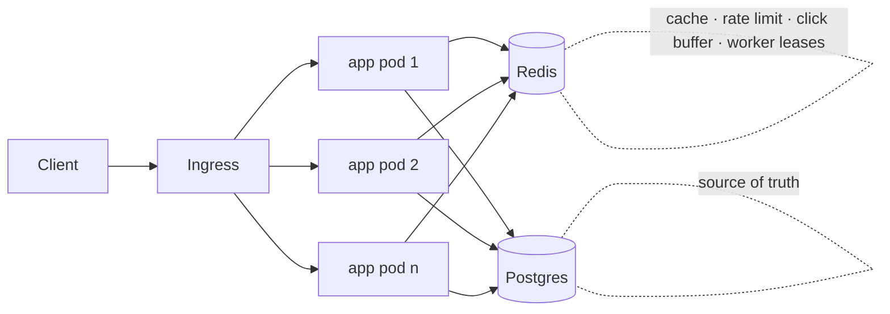

# TinyURL — a distributed URL shortener

A production-shaped URL shortener built to exercise the classic system-design questions end to end: coordination-free ID generation, a read-heavy cache path, abuse protection, async analytics, graceful degradation, and zero-downtime deployment on Kubernetes.

**Stack:** Java 22 · Spring Boot 4.1 · PostgreSQL 16 · Redis 7 · Flyway · Micrometer/Prometheus · Testcontainers · Docker · Kubernetes (kind)

---

## 1. Requirements and estimates

**Functional**
- `POST /api/v1/urls` → short link (optional custom alias, optional expiry). Idempotent for the same long URL.
- `GET /{key}` → `302` redirect.
- `GET /api/v1/urls/{key}` → metadata incl. click count.

**Non-functional**
- Read-heavy: assume 100 : 1 redirect : create.
- Redirect p99 < 50 ms from cache; service must keep redirecting if Redis is down.
- Horizontally scalable, stateless application tier.
- No single coordinator on the write path.

**Back-of-envelope**

| Assumption | Value |
|---|---|
| New links / day | 1 M (~12 writes/s, peak ×5 → 60/s) |
| Redirects / day | 100 M (~1,200/s, peak ×5 → 6,000/s) |
| Row size | ~300 B (URL, key, timestamps, counter) |
| Storage, 5 years | 1.8 B rows ≈ 550 GB (Postgres handles this; partition by id range at ~10×) |
| Key space | 8 Base62 chars = 62⁸ ≈ 2.2 × 10¹⁴ ≫ 1.8 B |

---

## 2. Architecture



**Write path:** normalize URL → idempotency lookup (`md5(long_url)` index) → Snowflake id → Base62 key → insert.

**Read path:** Redis `GET url:{key}` → hit: 302 · negative sentinel: 404 · miss: Postgres → populate cache (TTL capped by link expiry) → 302. Click is `INCR`'d in Redis and flushed to Postgres in batches.

---

## 3. Design decisions

### 3.1 ID generation — Snowflake with Redis-leased worker ids
Each instance generates ids locally with no database round-trip:

```
[ 32 bits: seconds since 2026-01-01 ][ 5 bits: worker id ][ 10 bits: sequence ]
```

- 47 bits → 8 Base62 characters. Capacity: 136 years, 32 concurrent workers, 1,024 ids/s/worker (~32k/s fleet-wide, far above any shortener's write load).
- **Worker id assignment** is the hard part on Kubernetes, where pods are ephemeral. Each pod claims a slot with `SET tinyurl:worker:lease:{n} <instance> NX EX 60`, renews it every 20 s via a compare-and-set Lua script, releases it on `SIGTERM`, and marks itself **not ready** if it ever finds its lease gone. A pod that dies without cleanup loses nothing: the lease expires and the slot is reclaimed.
- **Clock skew:** small backwards drift (≤ 5 s) is absorbed by continuing in the last second; larger drift refuses to issue ids rather than risk a collision.
- **Alternatives considered:** (a) DB sequence with range allocation — simple, dense ids, but Postgres remains the coordinator for every new pod; (b) hash of URL + collision check — needs a read-before-write and handles duplicates awkwardly; (c) 64-bit canonical Snowflake — 11-char keys. The 47-bit layout trades write throughput per worker for short keys; the constants live in one class and can be widened.
- **Known property:** keys encode time, so they are enumerable (as with bit.ly). A keyed Feistel permutation before Base62 would close that; not implemented.

### 3.2 Redirect semantics — 302, not 301
Browsers cache 301 permanently, which would hide clicks and make expiry/deletion unobservable. Responses also carry `Cache-Control: no-store`.

### 3.3 Caching — cache-aside with negative entries
- Positive entries: `url:{key} → long URL`, TTL 24 h, capped by the link's own expiry so a cached entry can never outlive it.
- Negative entries: same key, sentinel value, TTL 5 min, so a bot scanning random keys is absorbed by Redis instead of Postgres.
- Write-through was rejected: it adds a Redis dependency to the write path for a workload that is 99 % reads.

### 3.4 Idempotent creation
Same normalized URL → same key (`HTTPS://Example.com:443/a` and `https://example.com/a` are the same link). Known race: two *concurrent first-time* requests for the same URL can both insert, giving two keys for one URL. This is accepted (bit.ly behaves the same for anonymous users); the fix would be a unique index on `md5(long_url)` with catch-and-reread, which was a deliberate non-choice to keep custom aliases and re-creation after expiry simple.

### 3.5 Rate limiting — token bucket in Redis, fails open
A Lua script performs refill + take atomically per client key (60 tokens, 1/s refill). `429` carries `Retry-After`. If Redis is unreachable the limiter **allows** the request and records a metric: an outage in the abuse layer must not become an outage in the product. The client key honours `X-Forwarded-For`, which is only safe behind an ingress that overwrites the header (`server.forward-headers-strategy=framework`).

### 3.6 Click analytics — buffered, batched, at-least-once-ish
Redirects `INCR clicks:{key}` and add the key to a dirty set; a scheduled job (one instance at a time, via a short Redis lock) pops the set, `GETDEL`s each counter and applies `UPDATE … click_count = click_count + ?`. Clicks arriving mid-flush land in the next cycle. A lost Redis loses up to one flush interval of clicks — acceptable for analytics, and far cheaper than a write per redirect.

### 3.7 Graceful degradation
- Redis down → cache reads/writes fail soft (counted as `tinyurl.cache{result=error}`), redirects served from Postgres with a 200 ms Redis timeout bounding the added latency; rate limiter fails open.
- Postgres down → cached redirects keep working until TTLs expire; creates fail with 5xx; readiness goes DOWN so the pod stops receiving traffic; liveness stays UP so Kubernetes does not restart pods for a dependency outage.

### 3.8 Consistency model
Writes are strongly consistent (single Postgres). Reads are eventually consistent through the cache: a deleted/expired link may be served for up to its remaining cache TTL. The cache TTL cap (3.3) bounds that window for expiring links.

---

## 4. Failure modes

| Failure | Behaviour | Why acceptable |
|---|---|---|
| Redis unavailable | Redirects from DB, +≤200 ms; rate limiting off; clicks dropped | Product stays up; abuse/analytics are degradable |
| Postgres unavailable | Cached redirects continue; creates 5xx; pod not-ready | Correct: cannot write without the source of truth |
| Pod killed mid-request | `preStop` sleep + graceful shutdown drain in-flight requests; PDB keeps ≥1 pod | Zero failed requests observed during rolling update |
| Pod dies holding worker lease | Lease expires in 60 s, slot reused | Ids from that worker were already unique; nothing lost |
| Worker lease lost while running | Readiness DOWN, no new traffic | Prevents two workers sharing an id slot |
| Clock jumps backwards > 5 s | Id generation refuses | Collision is worse than a brief write outage |
| All 32 worker slots taken | Pod fails startup with a clear message | Widen `WORKER_BITS` (costs key length) |
| Duplicate custom alias | `409 Conflict` from the unique index, not a pre-check | No TOCTOU race |
| Redis memory pressure | `allkeys-lru` evicts cache entries first in practice | Leases/click buffers should move to a separate Redis at scale |

---

## 5. Scaling beyond this

At ~10× the estimates: Postgres read replicas for metadata; partition `urls` by id range (ids are time-ordered, so partitions are naturally hot→cold); Redis Cluster with the cache split from coordination keys; CDN/edge redirects for the hottest keys; widen the Snowflake layout or shard the key space by region prefix for multi-region writes.

---

## 6. Running it

**Local (Docker Compose)**
```bash
docker compose up --build
curl -i -X POST localhost:8080/api/v1/urls -H 'Content-Type: application/json' \
     -d '{"longUrl":"https://spring.io/projects/spring-boot"}'
curl -i localhost:8080/<key>            # 302
curl -s localhost:8080/actuator/prometheus | grep tinyurl_
```

**Tests** (Testcontainers; needs Docker running, nothing else)
```bash
./gradlew test
```

**Kubernetes (kind)**
```bash
kind create cluster --name tinyurl
docker build -t tinyurl:local . && kind load docker-image tinyurl:local --name tinyurl
kubectl apply -f k8s/
kubectl -n tinyurl port-forward svc/tinyurl 8080:80
```
Manifests include: 2-replica Deployment with startup/readiness/liveness probes wired to Spring's health groups, rolling update with `maxUnavailable: 0`, HPA (2–6 pods, 70 % CPU), PodDisruptionBudget, Postgres StatefulSet with PVC, Redis with LRU eviction, ConfigMap/Secret separation.

---

## 7. Evidence

- [ ] Screenshot: two pods logging different worker ids.
- [ ] Screenshot: `kubectl delete pod` during a curl loop — zero failures.
- [ ] Screenshot: `/actuator/health/readiness` with Redis stopped, redirect still 302.
- [ ] Load test: `[tool]`, `[N]` VUs, warm key p95 `[x]` ms / cold key p95 `[y]` ms, cache hit ratio `[z]` %.

---

## 8. Project layout

```
src/main/java/dev/system/tinyurl
├── id/            Snowflake generator, worker-id leasing, health indicator
├── shortener/     Base62 codec
├── url/           entity, repository, normalizer, cache port, service
├── controller/    REST API, redirect, ProblemDetail error handling
├── ratelimiter/   Redis token bucket + servlet filter
└── analytics/     click buffering and batched flush
k8s/               Kubernetes manifests
```

## 9. Not done (deliberately)
Authentication/ownership of links · Feistel-permuted keys · Bloom filter ahead of the negative cache · Grafana dashboards · the "file sharing" half of the repo name (presigned S3/MinIO uploads behind a short link).
