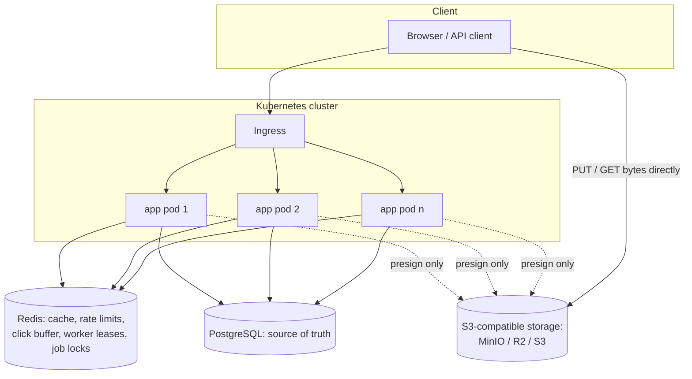

# TinyURL + Ephemeral File Sharing

A distributed URL shortener with a temporary file-sharing system built on top of it.

Two products, one platform:

- **Short links** — `POST` a long URL, get a compact key, `GET /{key}` redirects. Optimised for a 100:1 read/write ratio.
- **File shares** — upload a file through a presigned URL, share a secret link, and the file deletes itself when it expires, hits its download limit, or is read once.

The project exists to work through the classic distributed-systems questions with running code rather than diagrams: generating unique IDs without a central coordinator, serving a read-heavy path from cache, degrading gracefully when a dependency dies, moving bytes without proxying them, and making "temporary" actually mean temporary.

**Stack:** Java 22 · Spring Boot 4.1 · PostgreSQL 16 · Redis 7 · S3-compatible storage (MinIO) · Flyway · Micrometer/Prometheus · Testcontainers · Docker · Kubernetes

---

## Table of contents

1. [Quick start](#1-quick-start)
2. [Requirements and estimates](#2-requirements-and-estimates)
3. [Architecture](#3-architecture)
4. [Request flows, end to end](#4-request-flows-end-to-end)
5. [Design decisions](#5-design-decisions)
6. [Failure modes](#6-failure-modes)
7. [Code guide: every class, by role](#7-code-guide-every-class-by-role)
8. [Data model](#8-data-model)
9. [Configuration reference](#9-configuration-reference)
10. [API reference](#10-api-reference)
11. [Testing strategy](#11-testing-strategy)
12. [Deployment](#12-deployment)
13. [Scaling beyond this](#13-scaling-beyond-this)
14. [Things deliberately not done](#14-things-deliberately-not-done)

---

## 1. Quick start

**Everything in Docker:**
```bash
docker compose up --build
```
Brings up Postgres, Redis, MinIO and the app. MinIO's console is at `http://localhost:9001` (`minioadmin` / `minioadmin`).

**Shorten a URL:**
```bash
curl -i -X POST localhost:8080/api/v1/urls \
  -H 'Content-Type: application/json' \
  -d '{"longUrl":"https://spring.io/projects/spring-boot"}'

curl -i localhost:8080/<key>          # 302 to the target
```

**Share a file:**
```bash
./demo.sh                              # initiate -> upload -> complete -> prints the share URL
```

**Run the tests** (Testcontainers; needs Docker running, nothing else):
```bash
./gradlew test
```

---

## 2. Requirements and estimates

### Functional

| | |
|---|---|
| `POST /api/v1/urls` | create a short link; optional custom alias and expiry; idempotent per long URL |
| `GET /{key}` | 302 redirect, click counted |
| `POST /api/v1/files` | reserve a share, receive a presigned upload URL |
| `POST /api/v1/files/{key}/complete` | confirm the bytes arrived |
| `GET /f/{secret}` | recipient landing page |
| `GET /f/{secret}/download` | 302 to a 60-second presigned download URL |

### Non-functional

- Read-heavy: roughly 100 redirects per link created.
- Redirect p99 under 50 ms when served from cache.
- Redirects must keep working when Redis is unavailable.
- Application tier stateless and horizontally scalable.
- No single coordinator on the write path.
- Every shared file must eventually be deleted, even if the application crashes.

### Back-of-envelope

| Assumption | Value |
|---|---|
| New links/day | 1 M (~12 writes/s, peak ×5 → 60/s) |
| Redirects/day | 100 M (~1,200/s, peak ×5 → 6,000/s) |
| Row size | ~300 B |
| Storage, 5 years | 1.8 B rows ≈ 550 GB — Postgres handles this; partition by ID range at ~10× |
| Key space | 8 Base62 chars = 62⁸ ≈ 2.2 × 10¹⁴, versus 1.8 B rows used |
| ID throughput | 1,024/s per worker × 32 workers ≈ 32k/s, well above the 60/s peak |

---

## 3. Architecture



The dashed line is the important one. The application **signs** URLs for the storage layer but never carries file bytes itself. A 10 GB transfer costs the app a few milliseconds of CPU, which is why a 384 MB pod can serve it.

### What each datastore holds

| Store | Contents | Loss tolerance |
|---|---|---|
| **PostgreSQL** | URL mappings, file share metadata | None — source of truth |
| **Redis** | URL cache (TTL), rate-limit buckets, click counters awaiting flush, Snowflake worker-ID leases, scheduled-job locks | Tolerable — see [Failure modes](#6-failure-modes) |
| **Object storage** | File bytes under opaque UUID keys | None while a share is live; everything is deleted on expiry |

### Layering

```
controller/     HTTP: routing, status codes, view selection
    |
service/        Business rules, transactions, orchestration
    |
url/ files/     Domain entities, repositories, value objects
id/ storage/    Infrastructure ports and their implementations
```

Dependencies point downward only. The service layer never imports anything from `controller`; the domain never imports Spring Web. This is why `UrlShortenerService` can be unit-tested with plain Mockito and no servlet container.

---

## 4. Request flows, end to end

### 4.1 Creating a short link

```
POST /api/v1/urls {"longUrl": "https://Example.COM:443/a?b=1#frag"}
  |
  |- RateLimitFilter          token bucket in Redis, keyed by client IP
  |- UrlApiController         @Valid binds and validates the request record
  |- UrlShortenerService.shorten()
  |    |- UrlNormalizer       -> "https://example.com/a?b=1"  (fragment dropped, port folded)
  |    |- repo.findByLongUrl  -> idempotency check via the md5(long_url) index
  |    |- IdGenerator.nextId  -> 47-bit Snowflake ID, no DB round-trip
  |    |- Base62Codec.encode  -> 8-character key
  |    \- repo.saveAndFlush   -> INSERT; unique violation => AliasTakenException
  \- 201 Created, Location: http://host/{key}
```

The normalizer is what makes idempotency real: `HTTPS://Example.COM:443/a` and `https://example.com/a` produce the same key rather than two.

### 4.2 Following a short link

```
GET /{key}
  |
  |- RateLimitFilter
  |- RedirectController       Timer records latency
  |- UrlShortenerService.resolve()
  |    |- UrlCache.get("url:{key}")
  |    |    |- hit       -> return immediately            (the 99% path)
  |    |    |- sentinel  -> NotFoundException, no DB hit  (bot protection)
  |    |    \- miss      |
  |    |- repo.findByShortKey
  |    |    \- empty -> cache.putNegative(5 min) -> NotFoundException
  |    |- expired? -> cache.evict -> LinkExpiredException (410)
  |    \- cache.put(key, url, min(24h, time-until-expiry))
  |- ClickCounter.record      INCR in Redis + add to a dirty set; never touches Postgres
  \- 302 Found, Cache-Control: no-store
```

Ten seconds later, `ClickFlushJob` drains the dirty set and applies the counts to Postgres in one batch, under a Redis lock so only one pod does it.

### 4.3 Sharing a file

```
(1) POST /api/v1/files {"filename":"report.pdf","contentType":"application/pdf","sizeBytes":1024}
      FileShareService.initiate()
        |- validate size against the configured maximum, TTL against maxTtl
        |- SecretKeyGenerator  -> 128 random bits -> 22-char URL-safe key
        |- objectKey = "uploads/" + UUID   (deliberately unrelated to the secret key)
        |- INSERT row with status = PENDING
        \- FileStorage.presignUpload(objectKey, contentType)
      -> 201 {secretKey, uploadUrl, uploadContentType, shareUrl, expiresAt}

(2) PUT <uploadUrl>  (browser -> storage directly; the app is not involved)
      The Content-Type header must equal uploadContentType exactly, because the
      signature covers it. A mismatch is a 403 from the storage layer.

(3) POST /api/v1/files/{secretKey}/complete
      FileShareService.complete()
        |- storage.head(objectKey) -> absent => 409 UploadNotCompleted
        |- size over the limit => delete the object, mark DELETED, 413
        \- markReady(size, contentType) taken FROM STORAGE, not from the client
      -> 200 {status: "READY", sizeBytes, ...}
```

### 4.4 Receiving a file

```
GET /f/{secret}                          (human clicks the link)
  \- FileDownloadController.landing -> file-landing.html
       filename, size, "expires in 3 hours", downloads remaining, a Download button

GET /f/{secret}/download
  |- FileShareService.issueDownload()
  |    |- PENDING            => 409
  |    |- DELETED / expired / limit reached => 410 Gone
  |    |- recordDownload()   increments the counter
  |    |- presignDownload()  60-second TTL, Content-Disposition with the real filename
  |    \- burn-after-read or limit now reached => markDeleted(now)
  |         the row is dead instantly, the bytes are removed later by the sweeper
  \- 302 to the presigned URL -> browser downloads straight from storage
```

### 4.5 The sweeper, every 60 seconds

```
FileSweeperJob.sweep()          one pod at a time, via a Redis lock
  |- sweepExpired()    expired but still live  -> delete bytes, mark DELETED
  |- purgeDeleted()    DELETED past the grace  -> delete bytes (idempotent), drop the row
  \- sweepAbandoned()  PENDING older than 1h   -> delete orphaned bytes, drop the row
```

Rows stay for an hour after deletion so a late recipient gets an honest `410 Gone` rather than a bare `404`.

---

## 5. Design decisions

### 5.1 ID generation — Snowflake with Redis-leased worker IDs

Each instance generates IDs in memory with no database round-trip:

```
+--------------------------+----------+--------------+
| 32 bits: seconds since   | 5 bits:  | 10 bits:     |
| 2026-01-01               | worker   | sequence     |
+--------------------------+----------+--------------+
   136 years of range        32 workers  1,024 IDs/s/worker
```

47 bits encodes to exactly 8 Base62 characters.

**The hard part is worker-ID assignment on Kubernetes**, where pods are ephemeral and have no stable identity. The solution is a lease:

1. On startup, loop slots 0–31 and try `SET tinyurl:worker:lease:{n} <instance> NX EX 60`. First success wins.
2. A heartbeat every 20 s renews the lease with a compare-and-set Lua script, so an instance can never renew a lease it no longer owns.
3. If the heartbeat finds the lease gone, the instance marks itself **unhealthy** and Kubernetes stops routing to it — preventing two workers from ever sharing a slot.
4. On `SIGTERM`, the lease is released via compare-and-delete so the slot is immediately reusable.
5. A pod that dies without cleanup loses nothing: the lease expires in 60 s.

**Clock skew** is handled explicitly. Backwards drift of 5 s or less is absorbed by continuing to issue in the last known second. Larger drift throws `ClockMovedBackwardsException` rather than risk issuing a duplicate ID.

**Alternatives considered:**

| Approach | Why not |
|---|---|
| DB sequence with range allocation | Simple and dense, but Postgres coordinates every new pod. Fine single-region, awkward across regions. |
| Hash of the URL with collision checking | Requires a read before every write, and handles duplicate URLs awkwardly. |
| Canonical 64-bit Snowflake (41/10/12) | 11-character keys. The 47-bit layout trades per-worker throughput for short links. |

**Known property:** keys encode time and are therefore enumerable, as bit.ly's are. Acceptable for public short links. **Not** acceptable for file shares — see 5.6.

### 5.2 Redirect semantics — 302, not 301

Browsers cache 301 permanently. That would hide clicks from analytics and make expiry and deletion unobservable: a user who once followed a now-deleted link would keep being redirected by their own browser. Responses also carry `Cache-Control: no-store`.

### 5.3 Caching — cache-aside with negative entries

- Positive: `url:{key} -> long URL`, TTL 24 h, **capped by the link's own expiry** so a cached entry can never outlive the link it represents.
- Negative: the same key holds a sentinel value with a 5-minute TTL. A bot scanning random keys is absorbed by Redis instead of hammering Postgres, and a single `GET` distinguishes hit, known-missing, and unknown.

Write-through was rejected: it would put Redis on the write path for a workload that is 99% reads.

### 5.4 Idempotent link creation

The same normalized URL returns the same key. A known race exists: two *concurrent first-time* requests for one URL can both insert, producing two keys. This is accepted — bit.ly behaves the same for anonymous users — and the fix (unique index on `md5(long_url)` plus catch-and-reread) was a deliberate non-choice, because it complicates custom aliases and re-creation after expiry.

### 5.5 Rate limiting — token bucket in Redis, failing open

Refill and take happen atomically inside a Lua script, so concurrent requests across pods can't over-spend a bucket. `429` responses carry `Retry-After`.

**The limiter fails open.** If Redis is unreachable, requests are allowed and a metric is incremented. An outage in the abuse-prevention layer must not become an outage in the product.

Client identity comes from `X-Forwarded-For` when present, which is only safe behind an ingress that overwrites that header. `server.forward-headers-strategy=framework` is set accordingly.

### 5.6 File links are capability URLs

This is the most important security decision in the project.

Short-link keys are Snowflake-derived and enumerable. If file shares used the same scheme, anyone could walk the key space and download strangers' files. File shares therefore use a **separate key type**: 128 bits from `SecureRandom`, URL-safe Base64, 22 characters. Possession of the URL *is* the authorization, so the URL must be unguessable.

A related decision: `object_key` is a random UUID with no relationship to `secret_key`. If they matched, learning the storage layout would let an attacker derive object paths from links, and rotating a link would mean physically moving bytes. Identity and location are kept separate.

### 5.7 Bytes never pass through the application

Uploads and downloads use presigned URLs, so the client talks to object storage directly. Consequences worth stating:

- The app's memory and CPU are independent of file size.
- A rolling deployment can't interrupt a transfer in progress.
- The size limit is enforced **after** upload via `head()`, not from the client's claim, because a client's declared size is unverified. The declared size is only used to reject obviously-oversized requests before issuing a URL.
- The signed `Content-Type` must be echoed exactly by the uploading client, which is why the API returns `uploadContentType`.

### 5.8 Expiry is enforced in three independent layers

1. **On read** — `expires_at` is checked on every access, so an expired file is unreachable the instant it expires regardless of any background job.
2. **The sweeper** — deletes objects and rows on a schedule, with a Redis lock so only one pod runs it.
3. **A storage lifecycle rule** — the bucket itself expires objects, so even a week-long application outage can't leave files lying around.

Defence in depth: any one layer failing still results in deletion.

### 5.9 Burn-after-read is single-*attempt*, not single-*success*

When a burn link is used, the row is marked `DELETED` immediately so no further download URLs can be issued — the link dies at once. But the bytes survive until the sweeper's grace period elapses.

The alternative, deleting bytes during the request, means a dropped connection destroys the file permanently with no recourse. The grace period must exceed the presigned download TTL, otherwise an in-flight download would have its object removed underneath it.

### 5.10 410 Gone versus 404 Not Found

A share that existed but expired returns `410`; one that never existed returns `404`. That distinction usually leaks information, but is safe here: with 128 bits of entropy an attacker cannot enumerate keys to discover which ones existed. The benefit is a recipient learns "you're too late" rather than "you mistyped something".

### 5.11 Graceful degradation

- **Redis down** — cache reads and writes fail soft and are counted as `tinyurl.cache{result=error}`; redirects fall back to Postgres. A 200 ms Redis timeout bounds the added latency; without it, "fail soft" would mean "fail after 60 seconds".
- **Postgres down** — cached redirects keep working until TTLs expire; writes fail; readiness goes DOWN so the pod stops receiving traffic, while liveness stays UP so Kubernetes doesn't restart pods over a dependency outage.

### 5.12 Consistency model

Writes are strongly consistent — a single Postgres instance. Reads are eventually consistent through the cache: a deleted or expired link may be served for up to its remaining cache TTL. The TTL cap in 5.3 bounds that window for expiring links.

### 5.13 API errors versus human errors

The same failure produces different output depending on audience. `/api/v1/**` returns RFC 9457 `ProblemDetail` JSON with a machine-readable `code`. `/f/**` is a `@Controller` rather than a `@RestController` and renders an HTML page, because a person clicking a dead link should see a sentence, not JSON.

---

## 6. Failure modes

| Failure | Behaviour | Why it's acceptable |
|---|---|---|
| Redis unavailable | Redirects served from Postgres (+≤200 ms); rate limiting disabled; clicks dropped | Product stays up; abuse control and analytics are degradable |
| Postgres unavailable | Cached redirects continue; writes 5xx; pod marked not-ready | Correct: you cannot write without the source of truth |
| Object storage unavailable | Short links unaffected; file uploads and downloads fail | Blast radius contained to one feature |
| Pod killed mid-request | `preStop` sleep plus graceful shutdown drain in-flight requests; PDB keeps ≥1 pod | Zero failed requests during rolling updates |
| Pod dies holding a worker lease | Lease expires in 60 s, slot reused | IDs already issued were unique; nothing is lost |
| Worker lease lost while running | Readiness DOWN, traffic stops | Prevents two workers sharing an ID slot |
| Clock jumps backwards > 5 s | ID generation refuses | A collision is worse than a brief write outage |
| All 32 worker slots taken | Pod fails startup with an explicit message | Widen `WORKER_BITS` (costs key length) |
| Duplicate custom alias | 409 from the unique index, not from a pre-check | No time-of-check/time-of-use race |
| Upload initiated, never completed | Row stays PENDING, swept after 1 h | Orphaned bytes cannot accumulate |
| Sweeper fails to delete an object | Logged, batch continues, retried next cycle | One bad object can't block the queue |
| Application down for days | Storage lifecycle rule still expires objects | "Temporary" doesn't depend on the app running |
| Redis memory pressure | `allkeys-lru` evicts | Cache entries are disposable; leases and locks should move to a separate Redis at scale |

---

## 7. Code guide: every class, by role

> Package root: `dev.system.tinyurl`

### 7.1 Bootstrap

| Class | Responsibility |
|---|---|
| `TinyurlApplication` | Entry point. `@ConfigurationPropertiesScan` registers the `*Properties` records; `@EnableScheduling` activates the heartbeat, click flusher, and sweeper. |

### 7.2 ID generation — `id/`

The coordination-free identity layer.

| Class | Responsibility |
|---|---|
| `SnowflakeLayout` | Bit widths, epoch, and derived shifts/masks in one place. A static check asserts the layout fits in a signed long. Change the layout here and everything follows. |
| `IdGenerator` | One-method port: `long nextId()`. Everything downstream depends on this, not on Snowflake. |
| `SnowflakeIdGenerator` | The generator. `synchronized` (the critical section is nanoseconds), spins to the next second on sequence overflow, absorbs small clock drift, refuses on large drift. `decode(id)` returns the three fields for debugging and tests. |
| `ClockMovedBackwardsException` | Thrown when drift exceeds tolerance. Its own type so it's greppable in logs and assertable in tests. |
| `WorkerIdAssigner` | Port: `assign()` once at startup, `isHealthy()` continuously. Two implementations, chosen by configuration. |
| `StaticWorkerIdAssigner` | Reads a fixed ID from config. Used in local development and tests, where Redis coordination is pointless. |
| `RedisLeaseWorkerIdAssigner` | The real one. Claims a slot with `SET NX EX`, renews and releases with compare-and-set Lua scripts, marks itself unhealthy on lease loss, releases on shutdown via `DisposableBean`. |
| `WorkerLeaseHealthIndicator` | Surfaces `isHealthy()` to the actuator so a lease-less pod is pulled from the load balancer. |
| `IdConfiguration` | Wires the pieces: picks the assigner, builds the generator with its worker ID, schedules the heartbeat. Also provides the `Clock` bean, which is what makes time-dependent logic testable everywhere else. |
| `IdProperties` | `worker-id`, `lease-ttl`, `heartbeat`. Validates that the heartbeat is at most half the lease TTL. |

### 7.3 Short links — `shortener/`, `url/`

| Class | Responsibility |
|---|---|
| `Base62Codec` | `long <-> String` in `[0-9A-Za-z]`. Pure, static, no dependencies. |
| `UrlMapping` | JPA entity. Implements `Persistable<Long>` so Spring Data issues a plain INSERT rather than a SELECT-then-INSERT for application-assigned IDs. Behaviour (`isExpired`) lives on the entity, not in the service. |
| `UrlMappingRepository` | `findByShortKey`, `findByLongUrl` (native query using the `md5(long_url)` index, with an equality check to guard against md5 collisions), and a batched `incrementClickCount`. |
| `UrlNormalizer` | Canonicalizes a URL: lowercases scheme and host, folds default ports, drops the fragment, rejects non-HTTP schemes. This is what makes idempotency meaningful. |
| `UrlCache` | Cache port with a `CachedUrl(longUrl, negative)` record. Exists so the service is unaware of Redis and so failure handling has exactly one home. |
| `RedisUrlCache` | Redis implementation. Every operation is wrapped so failures degrade to a miss rather than propagating, and each outcome increments a Micrometer counter tagged hit/miss/negative/error. |
| `CacheProperties` | `ttl` (24 h) and `negative-ttl` (5 min). |

### 7.4 File sharing — `files/`

| Class | Responsibility |
|---|---|
| `FileShare` | JPA entity and state machine: PENDING -> READY -> DELETED. Carries the rules as methods (`isExpired`, `isExhausted`, `isDownloadable`, `remainingDownloads`) so no caller has to reassemble them. `markDeleted(now)` records when the grace period started. |
| `FileShareRepository` | `findBySecretKey` plus the three sweeper queries: `findExpired`, `findPurgeable`, `findAbandoned`. |
| `SecretKeyGenerator` | 128 bits from `SecureRandom` -> 22 URL-safe characters. Small class, large security consequence; the reasoning lives in its Javadoc. |
| `FileSweeperJob` | The lifecycle enforcer. Three passes under a Redis lock; a failed delete is logged and retried next cycle rather than aborting the batch. |
| `FileShareProperties` | `default-ttl`, `max-ttl`, `abandoned-after`, `purge-grace`. The constructor rejects a default TTL larger than the maximum. |

### 7.5 Object storage — `storage/`

| Class | Responsibility |
|---|---|
| `FileStorage` | Port: `presignUpload`, `presignDownload`, `head`, `delete`. The entire application talks to this interface, which is why MinIO, R2, and S3 are interchangeable. |
| `S3FileStorage` | AWS SDK v2 implementation. Sets `Content-Disposition` on download presigns so files save under their real names, and sanitizes that filename to prevent header injection. |
| `StorageConfiguration` | Builds `S3Client` and `S3Presigner`. Enables path-style addressing (required by MinIO and R2) and — importantly — points the presigner at the **public** endpoint while the client uses the internal one. |
| `StorageProperties` | `endpoint`, `public-endpoint`, `bucket`, credentials, the two URL TTLs, and the maximum file size. |
| `BucketInitializer` | `ApplicationRunner` that creates the bucket if absent, so a fresh clone works with no manual setup. |

### 7.6 Application services — `service/`

| Class | Responsibility |
|---|---|
| `UrlShortenerService` | `shorten` (normalize -> idempotency check -> ID -> key -> insert), `resolve` (cache-aside with negative caching and expiry), `metadata`. Transaction boundaries live here. |
| `FileShareService` | `initiate` (validate -> reserve -> presign), `complete` (verify with `head`, trust storage over the client), `issueDownload` (state checks -> count -> presign -> conditionally burn), `metadata`, `revoke`. |

### 7.7 HTTP layer — `controller/`, `dto/`, `api/`

| Class | Responsibility |
|---|---|
| `UrlApiController` | `POST /api/v1/urls`, `GET /api/v1/urls/{key}`. Returns 201 for a new link and 200 for an idempotent hit — a small detail that tells a client which happened. |
| `RedirectController` | `GET /{key:[A-Za-z0-9_-]{1,8}}` — the path regex is what keeps `/api/**` and `/actuator/**` from matching. Records the click after a successful resolve, never before. Times the resolve with Micrometer. |
| `FileApiController` | The sender's API: initiate, complete, metadata, revoke. Builds share URLs from `AppProperties.baseUrl()`. |
| `FileDownloadController` | The recipient's pages: the landing page and the download redirect. A `@Controller`, so failures render HTML. Also holds the human-friendly size and duration formatters. |
| `ApiExceptionHandler` | One `@ExceptionHandler` per domain exception, mapping to status plus a stable machine-readable `code`. Annotated `@Order(HIGHEST_PRECEDENCE)` so it beats Spring Boot's built-in advice. |
| `AppProperties` | `base-url`, trailing slashes stripped. In Kubernetes this is an environment variable, because the app cannot infer its public hostname from the port it binds to. |
| `dto/*` | Request and response records. Deliberately **top-level** types: records nested inside a holder class caused Jackson binding failures, and `Boolean` is used rather than `boolean` for optional flags so an omitted field doesn't fail deserialization. |

### 7.8 Rate limiting — `ratelimiter/`

| Class | Responsibility |
|---|---|
| `RedisRateLimiter` | Token bucket as a Lua script: refill and take are one atomic operation. Returns allowed, remaining, and retry-after. Fails open on any Redis error. |
| `RateLimitFilter` | `OncePerRequestFilter` that applies the limiter, sets `X-RateLimit-Remaining`, and returns problem-JSON with `Retry-After` on 429. Skips `/actuator`. Resolves the client from `X-Forwarded-For`. |
| `RateLimitProperties` | `enabled`, `capacity`, `refill-per-second`. |

### 7.9 Analytics — `analytics/`

| Class | Responsibility |
|---|---|
| `ClickCounter` | `INCR clicks:{key}` plus `SADD` to a dirty set. Fire-and-forget and exception-swallowing: a lost click is acceptable, a slow redirect is not. |
| `ClickFlushJob` | Every 10 s, under a Redis lock, pops the dirty set and applies counts with `GETDEL` so clicks arriving mid-flush land in the next cycle rather than vanishing. |

### 7.10 Cross-cutting

| Class | Responsibility |
|---|---|
| `RequestIdFilter` | Accepts or generates `X-Request-Id`, puts it in the MDC so every log line for a request is correlatable, and echoes it in the response. |
| `Exceptions/*` | Domain exceptions as plain `RuntimeException`s. They carry no HTTP knowledge — the mapping to status codes lives entirely in `ApiExceptionHandler`, so the service layer stays transport-agnostic. |

### 7.11 Templates

| File | Purpose |
|---|---|
| `templates/file-landing.html` | What the recipient sees: filename, size, expiry, downloads left, download button. Uses `th:text` exclusively — never `th:utext` — because the filename is attacker-controlled. `noindex` and `no-referrer` meta tags keep shared links out of search engines and referrer headers. |
| `templates/file-unavailable.html` | The honest dead end for expired, burned, or revoked links. |

---

## 8. Data model

### `urls`

| Column | Type | Notes |
|---|---|---|
| `id` | BIGINT PK | Snowflake, assigned by the application |
| `short_key` | VARCHAR(8) UNIQUE | Base62 of the ID, or a custom alias |
| `long_url` | TEXT | Normalized form |
| `created_at` | TIMESTAMPTZ | |
| `expires_at` | TIMESTAMPTZ NULL | NULL means no expiry |
| `click_count` | BIGINT | Updated in batches from Redis |

Index on `md5(long_url)` supports the idempotency lookup without indexing an unbounded text column.

### `file_shares`

| Column | Type | Notes |
|---|---|---|
| `id` | BIGINT PK | Snowflake |
| `secret_key` | VARCHAR(32) UNIQUE | 22-char capability token |
| `object_key` | VARCHAR(128) UNIQUE | `uploads/{uuid}` — unrelated to `secret_key` |
| `filename` | VARCHAR(255) | As supplied by the uploader; escaped on render |
| `content_type`, `size_bytes` | | Populated from storage on completion |
| `status` | VARCHAR(16) | PENDING / READY / DELETED |
| `max_downloads`, `download_count` | | Limit enforcement |
| `burn_after_read` | BOOLEAN | Implies `max_downloads = 1` |
| `created_at` | TIMESTAMPTZ | Drives abandoned-upload sweeping |
| `expires_at` | TIMESTAMPTZ **NOT NULL** | Every share must die |
| `deleted_at` | TIMESTAMPTZ NULL | Starts the purge grace period |

Migrations are Flyway files under `src/main/resources/db/migration`, applied automatically at startup.

---

## 9. Configuration reference

Every value below is overridable by environment variable using Spring's relaxed binding (`tinyurl.storage.bucket` -> `TINYURL_STORAGE_BUCKET`).

```yaml
tinyurl:
  app:
    base-url: http://localhost:8080         # public origin for short and share URLs

  id:
    worker-id:                              # unset => lease a slot from Redis
    lease-ttl: 60s
    heartbeat: 20s                          # must be <= lease-ttl / 2

  cache:
    ttl: 24h
    negative-ttl: 5m

  ratelimit:
    enabled: true
    capacity: 60
    refill-per-second: 1

  analytics:
    flush-interval: 10s

  storage:
    endpoint: http://minio:9000             # what the app calls
    public-endpoint: http://localhost:9000  # what presigned URLs are signed for
    bucket: tinyurl-files
    access-key: minioadmin
    secret-key: minioadmin
    upload-url-ttl: 15m                     # generous: large files take time
    download-url-ttl: 60s                   # short: the URL is the capability
    max-file-size-bytes: 104857600          # 100 MB

  files:
    default-ttl: 24h
    max-ttl: 7d
    abandoned-after: 1h
    purge-grace: 1h                         # must exceed download-url-ttl
    sweep-interval: 60s

spring:
  data:
    redis:
      timeout: 200ms                        # bounds how long a dead Redis stalls a request
      connect-timeout: 500ms

server:
  shutdown: graceful
  forward-headers-strategy: framework       # only safe behind a trusted ingress
```

The committed credentials are local development defaults with no access to anything outside the machine. In a real cluster they come from a secrets manager.

---

## 10. API reference

### Short links

| | |
|---|---|
| `POST /api/v1/urls` | `{longUrl, customAlias?, expiresAt?}` -> **201** (or **200** if idempotent) with `Location` |
| `GET /{key}` | **302** to the target · **404** unknown · **410** expired |
| `GET /api/v1/urls/{key}` | metadata including `clickCount` |

### File shares

| | |
|---|---|
| `POST /api/v1/files` | `{filename, contentType?, sizeBytes, ttlSeconds?, maxDownloads?, burnAfterRead?}` -> **201** `{secretKey, uploadUrl, uploadContentType, shareUrl, expiresAt}` |
| `POST /api/v1/files/{key}/complete` | **200** with final metadata · **409** nothing uploaded · **413** too large |
| `GET /api/v1/files/{key}` | metadata |
| `DELETE /api/v1/files/{key}` | **204**, revoked immediately |
| `GET /f/{secret}` | HTML landing page |
| `GET /f/{secret}/download` | **302** to a 60-second presigned URL · **410** gone |

### Error format

```json
{
  "type": "about:blank",
  "title": "Conflict",
  "status": 409,
  "detail": "Alias 'promo' is already taken",
  "instance": "/api/v1/urls",
  "code": "ALIAS_TAKEN"
}
```

`code` is the stable contract; `detail` is for humans and may change. Codes in use: `VALIDATION_FAILED`, `MALFORMED_REQUEST`, `INVALID_URL`, `INVALID_EXPIRY`, `ALIAS_TAKEN`, `NOT_FOUND`, `EXPIRED`, `FILE_NOT_FOUND`, `FILE_TOO_LARGE`, `UPLOAD_NOT_COMPLETED`, `SHARE_GONE`, `INVALID_SHARE_REQUEST`, `RATE_LIMITED`.

---

## 11. Testing strategy

Three layers, each answering a different question.

**Unit tests — is the logic right, in isolation?**
`SnowflakeIdGeneratorTest` (monotonicity, sequence overflow, clock regression, 8-thread uniqueness), `Base62CodecTest`, `UrlNormalizerTest` (parameterized canonicalization), `UrlShortenerServiceTest` (Mockito: idempotency, cache-hit paths, TTL capping), `SecretKeyGeneratorTest`, `RateLimitFilterTest`.

A `MutableClock` test double makes time-dependent behaviour deterministic. Every clock-dependent class takes a `Clock` rather than calling `Instant.now()`, precisely so this is possible.

**Slice tests — is the HTTP contract right?**
`@WebMvcTest` with a mocked service: status codes, headers, validation, problem-JSON bodies, and Thymeleaf rendering (a broken template fails the test).

**Integration tests — does it work against real infrastructure?**
`@SpringBootTest` with Testcontainers running real Postgres, Redis, and MinIO. No developer setup beyond Docker. These prove the claims that matter: a second resolve never touches the database; a lease-losing instance goes unhealthy; a burn link dies after one use but its in-flight download still completes; the sweeper genuinely removes bytes from storage.

Fixtures that need impossible states — an already-expired share — are created with direct SQL rather than by adding setters to the entity. Keeping the domain immutable is worth a few lines of test SQL.

---

## 12. Deployment

### Docker

Multi-stage build: Gradle produces the jar, the runtime image is a JRE on Alpine running as a non-root user with `MaxRAMPercentage` set so the JVM respects container limits.

### Kubernetes (`k8s/`)

| Manifest | Contents |
|---|---|
| Namespace, ConfigMap, Secret | Configuration separated from credentials |
| Postgres StatefulSet + PVC + headless Service | Stable identity and storage |
| Redis Deployment + Service | `allkeys-lru`, memory-capped |
| MinIO StatefulSet + PVC + Service | Object storage |
| App Deployment | 2 replicas, `maxUnavailable: 0`, startup/readiness/liveness probes wired to Spring health **groups**, `preStop` sleep for connection draining, resource requests and limits |
| Service, Ingress, HPA (2–6 pods at 70% CPU), PodDisruptionBudget | Traffic and availability |

Probe design is deliberate: readiness includes the database, Redis, and the worker lease, so an unhealthy pod stops receiving traffic. Liveness includes none of them, so a dependency outage doesn't trigger a restart storm.

### Hosting note

This is a portfolio project and is not continuously hosted. It runs on `kind` locally or in a GitHub Codespace, and the manifests are cloud-agnostic. For a real deployment, object storage would move to Cloudflare R2 — egress dominates the cost model for file transfer, and R2 charges none — by changing `endpoint`, `bucket`, and credentials. Nothing in the code would change, which is the point of the `FileStorage` port.

---

## 13. Scaling beyond this

At roughly 10× the estimates:

- **Postgres** — read replicas for metadata; partition `urls` by ID range. Since Snowflake IDs are time-ordered, partitions split naturally into hot and cold.
- **Redis** — Redis Cluster, with the cache separated from coordination keys (leases, locks, click buffers) so cache eviction can never drop a worker lease.
- **Edge** — CDN or edge-worker redirects for the hottest keys, removing most traffic from the origin entirely.
- **IDs** — widen the Snowflake layout, or shard the key space by region prefix for multi-region writes.
- **Files** — multipart uploads above ~100 MB; virus scanning on completion; per-account quotas.

---

## 14. Things deliberately not done

- **Authentication and link ownership.** Everything is anonymous. Real file sharing needs accounts to make abuse traceable.
- **End-to-end encryption.** The strongest possible feature here: encrypt in the browser with a key held in the URL fragment, so the server stores ciphertext it cannot read. The schema was designed to accommodate it (content type is nullable, nothing assumes readable bytes), but the browser crypto is not implemented. A half-finished crypto feature would be worse than an honestly-scoped omission.
- **Malware scanning.** Mozilla shut down Firefox Send in 2020 because anonymous ephemeral file hosting became a malware distribution channel. Any real version of this needs scanning and abuse reporting.
- **Feistel-permuted short keys** to make them non-enumerable.
- **Bloom filter** in front of the negative cache.
- **Grafana dashboards** — metrics are exported, but no dashboards are committed.

---

## Appendix: notes from building this

Things that cost real debugging time and are worth knowing:

- **Presigned URLs sign the `Content-Type` header.** A client sending a different value gets a 403 that reads like a credentials problem. This is why the API returns `uploadContentType` for the client to echo.
- **Presigned URLs are signed for a specific host.** Inside Docker the app reaches storage at `minio:9000`, but a browser can't resolve that — hence the separate internal and public endpoints.
- **Jackson can't bind records nested inside a holder class** the way plain top-level records bind, and primitive fields fail on missing JSON when `FAIL_ON_NULL_FOR_PRIMITIVES` is enabled. Optional flags are `Boolean`, normalized in the compact constructor.
- **Spring Boot's built-in problem-detail advice** handles validation exceptions before a custom `@RestControllerAdvice` unless the custom one is explicitly ordered first.
- **Pinned images can vanish.** MinIO removed its images from Docker Hub in September 2026; the project pulls from the vendor's own registry at `quay.io` with an explicit release tag. A tag on a third-party registry is not a durable dependency.
